<picture>
  <source media="(prefers-color-scheme: dark)" srcset="./dark.svg" />
  <source media="(prefers-color-scheme: light)" srcset="./light.svg" />
  
</picture>

 

## About Me

I'm **Vincent** (he/him) — an **Automation Bot & Website Builder**. I build bots, automation systems, and software tools that reduce repetitive work. My projects range from chat automation and trading tools to game bots, AI-powered workflows, web applications, and practical side projects.

🟢 **Status:** Building Bots + Automating Workflows + Exploring AI + Shipping Side Projects
☕ **Fun fact:** I love coding while drinking my coffee.

 

## Currently

- 🔨 **Working on:** CV ATS Generator & Automatic Job Finder
- 📚 **Learning:** Distributed Systems
- 💬 **Ask me about:** React, Node.js, TypeScript

 

## Tech Stack

**Languages**

**Frontend**

**Backend**

**AI / ML**

**Database**

**Infra / Deployment**

**ToolChain**

 

## Featured Projects

| Project | Description |
|---|---|
| **[My Digital Store](https://github.com/meyat/mydigitalstore)** | TypeScript digital product store — digital product management, storefront experience, modern web development. |
| **[Auto PPT](https://github.com/meyat/auto-ppt)** | Automatically creates sermon presentation files — automated presentation creation, PPTX generation, supports 16:9 and 4:3 layouts. |
| **[Gmail Dot Generator](https://github.com/meyat/Gmail-Dot)** | Generates valid dot variations from a Gmail address — simple JavaScript automation utility. |
| **[WhatsApp Bot](https://github.com/meyat/bot-wa)** | WhatsApp automation bot — bot commands, JavaScript automation. |

 

## GitHub Stats

 

## Contribution Snake

<picture>
  <source media="(prefers-color-scheme: dark)" srcset="https://raw.githubusercontent.com/meyat/meyat/output/snake-dark.svg" />
  <source media="(prefers-color-scheme: light)" srcset="https://raw.githubusercontent.com/meyat/meyat/output/snake.svg" />
  
</picture>

 

## Connect With Me

&nbsp;&nbsp;&nbsp;&nbsp;&nbsp;&nbsp;&nbsp;&nbsp;

  

⚡ Automation Bot & Website Builder — building bots, automating workflows, shipping side projects.

