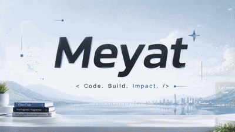

  

  

  

### 🚀 About Me

I build bots, automation systems, and software tools that reduce repetitive work.  
From chat automation and trading tools to game bots and AI-powered workflows, I enjoy turning ideas into practical projects.  
- Building bots and automation tools  
Exploring AI agents and intelligent workflows  
Automating repetitive tasks  
Developing useful side projects  
Portfolio: vinjor.web.id

🔭 &nbsp;I'm currently working on **CV Ats Generator &amp; Automatic Job Finder**  
🌱 &nbsp;I'm currently learning **Distributed System**  
💬 &nbsp;Ask me about **React, Node JS, Typescript**  
😄 &nbsp;Pronouns: **he/him**  
⚡ &nbsp;Fun fact: **I love coding while drinking my coffee**

### 🛠️ Tech Stack

  
  
  
  
  
  
  
  
  
  
  
  
  
  
  
  
  
  
  
  
  
  

### 🔗 Connect With Me

  
  
  
  

---

## ☠️ Featured Projects

<table>
<tr>
<td width="50%" valign="top">

### My Digital Store

Digital product store developed using TypeScript.

**Main focus:**

* Digital product management
* Storefront experience
* Modern web development

</td>
<td width="50%" valign="top">

### Auto PPT

Automatically creates sermon presentation files from provided material.

**Main focus:**

* Automated presentation creation
* PPTX file generation
* 16:9 and 4:3 layouts

</td>
</tr>

<tr>
<td width="50%" valign="top">

### Gmail Dot Generator

Generates valid dot variations from a single Gmail address.

**Main focus:**

* Email variation generation
* Simple automation
* JavaScript utility

</td>
<td width="50%" valign="top">

### WhatsApp Bot

A WhatsApp bot containing a collection of automation features.

**Main focus:**

* WhatsApp automation
* Bot commands
* JavaScript development

</td>
</tr>
</table>

---

### 📊 GitHub Stats

  

### 📈 Contribution Graph

  

### 💭 Dev Quote

  

---

<i>⭐️ From <a href="https://github.com/meyat">meyat</a></i>

